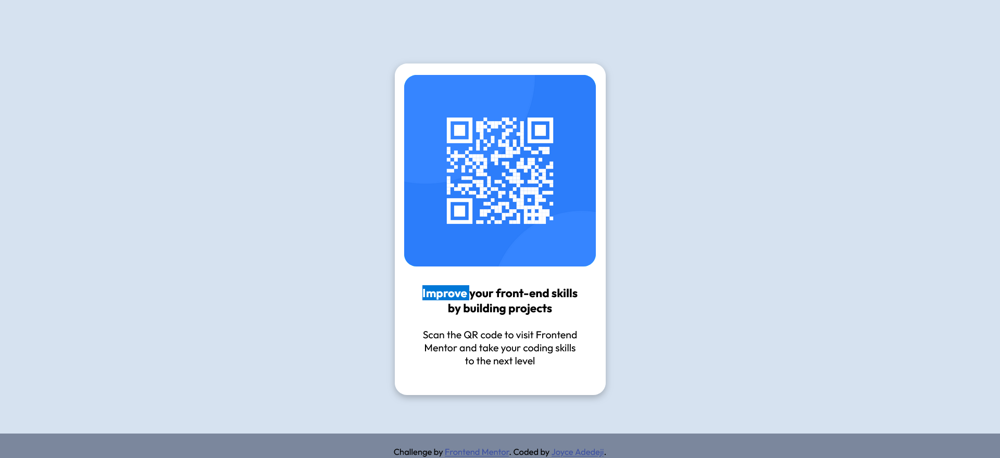

# Frontend Mentor - QR code component solution

This is a solution to the [QR code component challenge on Frontend Mentor](https://www.frontendmentor.io/challenges/qr-code-component-iux_sIO_H). Frontend Mentor challenges help you improve your coding skills by building realistic projects.

## Table of contents

- [Overview](#overview)
  - [Screenshot](#screenshot)
  - [Links](#links)
  - [Built with](#built-with)
  - [What I learned](#what-i-learned)
  - [Continued development](#continued-development)
- [Author](#author)

## Overview

This is a solution to the [QR code component challenge on Frontend Mentor](https://www.frontendmentor.io/challenges/qr-code-component-iux_sIO_H).

### Screenshot

### Links

- Solution URL: [https://github.com/joycejenny/qr-code-component-main]
- Live Site URL: [https://joycejenny.github.io/qr-code-component-main/]

### Built with

- Semantic HTML5 markup
- CSS custom properties
- Flexbox

### What I learned

I learnt more about CSS flex box properties, aligning items and text on the webpage, working with general colors for the project's webpage and formatting styles and sizes

### Continued development

-Flex-Box properties
-item positioning
-Others

## Author

- [Joyce Adedeji]

- Frontend Mentor - [https://www.frontendmentor.io/profile/joycejenny]
